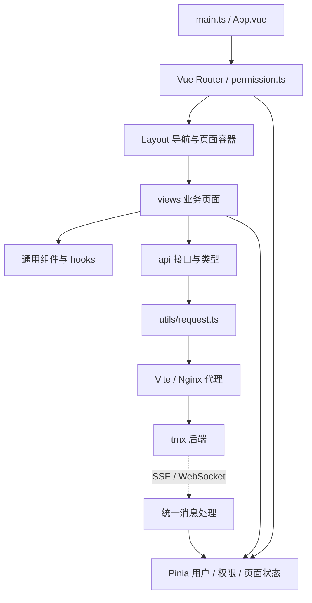

# tmx-vue

**tmx-vue 是 tmx 的配套前端模板。`tm` 表示模板，`x` 表示扩展。**

项目使用 Vue、TypeScript、Element Plus 和 Vite，提供登录、动态权限菜单、系统管理、工作流、监控入口、AI 聊天及通用业务组件。后端架构、数据库初始化和扩展服务部署见 [tmx README](../tmx/README.md)。

当前 npm 项目名为 `tmx-vue`，页面品牌为 `tmx`，版本为 `6.0.0`。本项目需要配套后端提供数据和权限，不包含可替代后端的完整 Mock 服务。

## 快速开始

启动顺序：**数据库 / Redis → tmx 后端 → tmx-vue 前端**。以下命令以 Windows PowerShell 为例。

Before starting, copy `.env.development.example` to `.env.development` and `.env.production.example` to `.env.production`. The examples disable API encryption; generate and configure matching frontend/backend keys if you enable it. Check committed environment settings before use outside development.

### 1. 检查 Node 与包管理器

在前端目录执行：

```powershell
Set-Location 'F:\_personal\_projects\tmx-vue'
node --version
corepack pnpm --version
```

本项目使用 **Node.js 22.23.1 + pnpm 10.34.5** 验证安装。`corepack pnpm` 会按 `package.json` 的 `packageManager` 调用指定版本，不要求先把 pnpm 安装到全局 PATH。

如果使用 nvm-windows，切换已安装的版本后重新检查：

```powershell
nvm use 22.23.1
node --version
```

若没有 `corepack` 命令，可通过 npm 临时执行指定版本，后续命令中的 `corepack pnpm` 同样替换为 `npx.cmd --yes pnpm@10.34.5`：

```powershell
npx.cmd --yes pnpm@10.34.5 --version
```

### 2. 先启动后端

按 [后端快速启动](../tmx/README.md#快速启动) 准备数据库、Redis 与 JDK，启动 `tmx-admin`。前端当前默认代理到 `http://localhost:8080`，若后端地址不同，修改 `vite.config.ts` 的 `server.proxy.target`。

### 3. 安装依赖并启动前端

```powershell
Set-Location 'F:\_personal\_projects\tmx-vue'
corepack pnpm install --frozen-lockfile
corepack pnpm dev
```

浏览器访问 **http://localhost:80**，实际地址以 Vite 终端输出为准。端口被占用时修改 `.env.development` 的 `VITE_APP_PORT`，然后重启开发服务。

构建检查：

```powershell
corepack pnpm build:prod
```

Linux / macOS 使用 `cd /你的路径/tmx-vue` 进入项目后，执行相同的 `corepack pnpm` 命令。Node.js 和 pnpm 的最低声明版本见 `package.json`，新环境优先使用上述验证版本。

### 4. 安装失败时怎么定位

| 现象 | 处理方式 |
| --- | --- |
| `vite` 不是内部或外部命令 | 说明启动时未找到项目本地依赖。先在 `tmx-vue` 目录运行 `corepack pnpm install --frozen-lockfile`，确认 `node_modules/.bin/vite.cmd` 存在，再重新运行 IDE 中的 `npm run dev`；同时检查 IDE 运行配置的工作目录是当前项目目录 |
| 找不到 `pnpm` 命令 | 使用 `corepack pnpm`；也可用 `npx.cmd --yes pnpm@10.34.5` 临时运行 |
| 切换 nvm 版本后 pnpm 消失 | 不同 Node 安装的全局命令可能不同，重新检查 `Get-Command node,pnpm,corepack -All` |
| `Unsupported engine` / Node 版本不符 | 检查当前终端的 `node --version`，切换到 Node.js 22.23.1 后重试 |
| `WARN` 下载速度慢 | 警告本身不表示失败；观察是否继续下载，最终以退出码和错误信息判断 |
| 下载超时或连接失败 | 检查网络和当前 registry；可仅对这次安装指定可访问的镜像，见下方命令 |
| 锁文件不一致 | 先确认在正确目录、使用指定 pnpm；核对 package.json、pnpm-workspace.yaml 和锁文件，不要直接删除锁文件或强制忽略冲突 |
| npm 安装与 pnpm 结果不同 | 本仓库以 pnpm-lock.yaml 为准，使用上面的固定 pnpm 命令复现；不要混用安装器维护依赖树 |

```powershell
# 仅在默认源下载失败时尝试；不会修改全局 registry
corepack pnpm install --frozen-lockfile --registry=https://registry.npmmirror.com
```

排查时保留执行命令、Node / pnpm 版本和报错最后几行。包管理器安装与 PATH 检查可参考 [pnpm 官方说明](https://pnpm.io/installation)，锁文件选项见 [安装命令说明](https://pnpm.io/cli/install)。

## 目录

- [快速开始](#快速开始)
- [整体架构](#整体架构)
- [目录结构](#目录结构)
- [页面与功能](#页面与功能)
- [技术栈](#技术栈)
- [常用命令](#常用命令)
- [环境变量与前后端约定](#环境变量与前后端约定)
- [路由与权限](#路由与权限)
- [状态管理与消息](#状态管理与消息)
- [通用组件与页面开发](#通用组件与页面开发)
- [主题与品牌定制](#主题与品牌定制)
- [构建与部署](#构建与部署)
- [常见问题](#常见问题)
- [来源与许可证](#来源与许可证)

## 整体架构



页面层组织交互，API 层定义接口与数据类型，请求层统一处理鉴权、错误和加解密。Pinia 保存跨页面状态；局部表单、弹窗和查询条件由页面或 hooks 管理。

### 登录后的页面加载

1. 登录页请求验证码，并向 `/auth/login` 提交登录信息及客户端信息。
2. 用户状态模块保存登录凭证，路由守卫加载用户信息、角色与权限。
3. 权限状态模块获取后端菜单，将 `component` 标识映射为本地 Vue 页面。
4. 动态注册路由，生成侧栏、顶部导航和可访问页面。
5. 页面通过 `src/api/` 调用业务接口，按权限显示操作按钮。
6. 登录后的消息逻辑根据配置建立 SSE 或 WebSocket 连接，更新消息盒子和未读数。

## 目录结构

```text
tmx-vue/
├─ package.json                 依赖与命令
├─ pnpm-lock.yaml               依赖锁定文件
├─ .env.development             开发环境配置
├─ .env.production              生产构建配置
├─ vite.config.ts               代理、构建与样式配置
├─ vite/plugins/                自动导入、组件、SVG、压缩等插件
├─ uno.config.ts                UnoCSS 配置
├─ gen/                         前端代码生成模板
├─ public/                      无需编译的静态资源与 favicon
└─ src/
   ├─ main.ts / App.vue         应用入口
   ├─ permission.ts            路由守卫
   ├─ settings.ts              默认布局、主题与交互设置
   ├─ api/                     业务接口与 types.ts
   ├─ assets/                  样式、SVG 图标、Logo、图片
   ├─ components/              通用组件
   ├─ directive/               权限、复制等指令
   ├─ enums/                   枚举定义
   ├─ hooks/                   查询、表格、树、弹窗等复用逻辑
   ├─ lang/                    中文、英文及国际化配置
   ├─ layout/                  导航、侧栏、标签页和主体布局
   ├─ plugins/                 权限、下载、缓存、弹窗、标签页等工具
   ├─ router/                  固定路由与路由初始化
   ├─ store/modules/           Pinia 状态模块
   ├─ types/                   环境、组件及公共类型声明
   ├─ utils/                   请求、鉴权、推送、加解密、通用工具
   └─ views/                   业务页面
      ├─ system/               系统管理
      ├─ monitor/              日志、在线用户、缓存、扩展服务入口
      ├─ workflow/             工作流与请假示例
      ├─ tool/gen/             代码生成
      ├─ ai/chat/              AI 聊天
      └─ demo/                 列表、树等示例
```

## 页面与功能

菜单是否显示取决于后端菜单配置及当前用户授权；文件、AI、调度等功能还依赖对应后端服务。

| 分类 | 功能 | 页面位置 |
| --- | --- | --- |
| 账户入口 | 登录、验证码、注册入口、第三方登录回调 | `views/login.vue`、`views/register.vue`、`layout/components/SocialCallback/` |
| 工作台 | 项目介绍、能力说明、可配置源码与文档入口 | `views/index.vue` |
| 用户与组织 | 用户、部门、岗位、个人资料 | `views/system/user/`、`dept/`、`post/` |
| 权限与配置 | 角色、菜单、字典、参数、客户端管理 | `views/system/role/`、`menu/`、`dict/`、`config/`、`client/` |
| 通知与消息 | 通知公告、导航栏消息盒子、未读数及已读处理 | `views/system/notice/`、`layout/components/Navbar.vue` |
| 文件管理 | 文件列表、上传下载、图片预览、存储配置 | `views/system/oss/` |
| 系统监控 | 在线用户、登录日志、操作日志、缓存监控 | `views/monitor/` |
| 服务入口 | 监控中心、SnailJob 调度中心、Snail AI 管理入口 | `views/monitor/admin/`、`snailjob/`、`snailai/` |
| 工作流 | 分类、流程定义、实例、表达式、任务处理及请假示例 | `views/workflow/`、`components/Process/` |
| 代码生成 | 表结构导入、字段设置、生成配置、代码预览与下载 | `views/tool/gen/` |
| AI 聊天 | 注册当前用户 AI 身份、嵌入聊天页、错误重试 | `views/ai/chat/` |
| 示例页面 | 标准列表与树形页面 | `views/demo/` |
| 页面框架 | 多种导航布局、标签页、面包屑、菜单搜索、全屏、暗色主题、中英文 | `layout/`、`settings.ts`、`lang/` |

AI 聊天页面嵌入后端提供的聊天入口，独立 AI 管理页面则使用环境变量中的服务地址。仅配置一个页面 URL 不会自动完成 AI 服务、应用和模型接入。

## 技术栈

下表基于当前 [package.json](package.json)，准确版本及安装结果以 package.json 和 pnpm-lock.yaml 为准。

| 方向 | 技术 |
| --- | --- |
| 应用与类型 | Vue 3.5.40、TypeScript ^6.0.3 |
| 构建 | Vite ^8.1.5、pnpm 10.34.5 |
| 路由与状态 | Vue Router 5.2.0、Pinia 4.0.2 |
| UI 与表格 | Element Plus 2.14.3、VXE Table / VXE PC UI |
| 样式 | Sass、UnoCSS、CSS 主题变量 |
| 请求与工具 | Axios、VueUse、await-to-js |
| 国际化 | vue-i18n，中英文资源 |
| 内容组件 | ECharts、wangEditor、Highlight.js、图片裁剪与 JSON 展示 |
| 代码质量 | oxlint、oxfmt、vue-tsc；仓库声明了 Vitest 依赖 |

## 常用命令

| 命令 | 用途 |
| --- | --- |
| `pnpm dev` | 启动 development 模式开发服务 |
| `pnpm build:dev` | 使用开发环境变量构建 |
| `pnpm build` / `pnpm build:prod` | 使用生产环境变量构建 |
| `pnpm preview` | 本地预览构建产物；接口访问仍需可用后端与代理 |
| `pnpm lint` | 使用 oxlint 检查 `src` |
| `pnpm lint:fix` | 自动修复可修复的检查项 |
| `pnpm fmt` | 使用 oxfmt 格式化项目 |
| `pnpm exec vue-tsc --noEmit` | 手动执行 Vue / TypeScript 类型检查 |

下表中 `pnpm` 命令也可写为 `corepack pnpm`。当前构建脚本执行 Vite 构建，不会自动调用 `vue-tsc`；也未提供 `test` npm script。增加测试时应同时明确测试命令和覆盖场景。


## 环境变量与前后端约定

环境配置位于 [.env.development](.env.development.example) 和 [.env.production](.env.production.example)。Vite 环境变量在开发启动或构建时读取，修改后需要重启开发服务或重新构建。

| 变量 | 当前用途 / 默认值 |
| --- | --- |
| `VITE_APP_TITLE` | 页面标题，当前为 `tmx 模板与扩展` |
| `VITE_APP_LOGO_TITLE` | 导航品牌标题，当前为 `tmx` |
| `VITE_APP_PORT` | 开发端口，当前为 `80` |
| `VITE_APP_CONTEXT_PATH` | 静态资源与路由基路径，当前为 `/` |
| `VITE_APP_BASE_API` | 开发 `/dev-api`；生产 `/prod-api` |
| `VITE_APP_CLIENT_ID` | 登录与接口请求的客户端标识，需与后端客户端配置对应 |
| `VITE_APP_ENCRYPT` | 接口加解密总开关，当前为 `true`；具体请求是否加密还受请求配置影响 |
| `VITE_APP_RSA_PUBLIC_KEY` / `VITE_APP_RSA_PRIVATE_KEY` | 与后端接口加解密配置配对使用 |
| `VITE_APP_MESSAGE_ENABLED` | 是否启用消息推送，当前为 `true` |
| `VITE_APP_MESSAGE_TRANSPORT` | `sse` 或 `websocket`，当前为 `sse` |
| `VITE_APP_MESSAGE_PATH` | 消息路径，当前为 `/resource/message` |
| `VITE_APP_MONITOR_ADMIN` | 监控应用列表入口 |
| `VITE_APP_SNAILJOB_ADMIN` | 调度中心入口 |
| `VITE_APP_SNAILAI_ADMIN` | AI 管理入口 |
| `VITE_APP_SOURCE_URL` / `VITE_APP_DOCS_URL` | 自己的源码与文档地址；为空时隐藏对应品牌入口 |

`VITE_*` 变量会进入前端运行环境，不应用于保存数据库、对象存储或模型服务的服务端密钥。接口加密配置的用途与服务端凭据不同。

### 开发代理

[vite.config.ts](vite.config.ts) 将开发接口前缀代理到 `http://localhost:8080`，并去掉前缀：

```text
浏览器 /dev-api/system/user/list
    → Vite 代理
    → 后端 http://localhost:8080/system/user/list
```

后端换地址时修改代理 `target`。仅调整 `VITE_APP_PORT` 不会改变后端地址。生产模式下 Vite 开发代理不参与工作，应由 Nginx 等服务器配置 `/prod-api/` 转发。

### 请求与响应

统一请求入口为 [src/utils/request.ts](src/utils/request.ts)，处理 Token、`clientid`、语言、重复提交、加解密、业务错误和登录失效等逻辑。

普通响应示例：

```json
{ "code": 200, "msg": "操作成功", "data": { "id": "1" } }
```

分页响应示例：

```json
{ "code": 200, "msg": "操作成功", "data": { "rows": [], "total": 0 } }
```

当前请求封装返回业务响应体，普通接口使用 `res.data` 读取业务数据，分页接口读取 `res.data.rows` 和 `res.data.total`。它不是未经处理的 AxiosResponse。类型定义见 [TmxAjaxResult](src/utils/api-types.ts) 和 [PageResult](src/api/types.ts)；文件下载与流式响应按对应实现处理。

## 路由与权限

### 固定路由

[src/router/index.ts](src/router/index.ts) 定义登录、注册、跳转、首页、个人中心、401 / 404 等固定路由。项目使用 HTML5 History 模式，生产服务器必须支持刷新时回退到 `index.html`。

### 动态路由

[src/store/modules/permission.ts](src/store/modules/permission.ts) 获取后端菜单，并将页面标识映射为 `src/views/` 下的组件。例如菜单 `component` 为 `system/client/index` 时，对应 `src/views/system/client/index.vue`。

`Layout`、`ParentView`、`InnerLink` 有专门映射逻辑。路由名需要保持唯一，并与缓存、菜单配置相协调；新增页面文件后，还需要后端菜单和角色授权才能进入正常导航。

### 按钮与接口权限

按钮权限通常使用 `v-hasPermi`，角色控制使用 `v-hasRoles`，也可以通过 `plugins/auth` 进行判断。前端权限负责展示和交互，实际接口访问权限由后端继续校验。新增功能需同步菜单权限标识、页面按钮和后端权限注解。

## 状态管理与消息

| Pinia 模块 | 职责 |
| --- | --- |
| `user` | 登录、用户信息、角色和权限 |
| `permission` | 后端菜单转换、动态路由、侧栏与顶部导航 |
| `app` | 设备类型、侧栏及应用显示状态 |
| `settings` | 主题、布局、标题及显示选项 |
| `tagsView` | 已访问标签页与缓存页面 |
| `dict` | 字典数据缓存 |
| `notice` | 消息列表、排序、未读数与已读状态 |

统一推送入口为 [src/utils/push.ts](src/utils/push.ts)，配合 `push-message.ts`、`message-read.ts` 和消息接口处理推送内容。切换 SSE / WebSocket 时，前端变量、后端 `message.*` 及代理配置必须同步。

页面刷新后，消息盒子可从后端加载消息，再通过推送更新。退出登录时会关闭推送连接，避免沿用旧用户连接。

## 通用组件与页面开发

### 通用组件

| 组件 | 用途 |
| --- | --- |
| `Pagination`、`RightToolbar` | 分页、查询栏切换及列表工具栏 |
| `DictTag` | 字典标签展示 |
| `TreePanel` | 树筛选区域 |
| `UserSelect`、`RoleSelect` | 用户、角色选择 |
| `FileUpload`、`ImageUpload`、`ImagePreview` | 文件和图片交互 |
| `Editor` | 富文本编辑 |
| `IconSelect`、`SvgIcon` | 图标选择与展示 |
| `Process` | 工作流相关交互 |
| `Breadcrumb`、`TopNav`、`ParentView` | 导航及路由容器 |
| `LangSelect`、`SizeSelect`、`Screenfull` | 语言、组件尺寸和全屏 |
| `TmxGit`、`TmxDoc` | 按配置显示自己的源码与文档入口 |

### 已有 hooks

| 目录 | 示例与职责 |
| --- | --- |
| `hooks/async/` | `useLoading`，异步加载状态 |
| `hooks/dialog/` | `useDialogState`、`useFormDialog`，弹窗及表单逻辑 |
| `hooks/form/` | 查询重置、查询栏显示、日期范围处理 |
| `hooks/table/` | 选中项、排序查询、表格全高布局 |
| `hooks/tree/` | 树面板折叠和树表展开 |

### 新增一个业务页面

1. 在 `src/api/业务/功能/` 定义接口和 `types.ts`，区分查询参数、提交表单与返回数据类型。
2. 在 `src/views/业务/功能/index.vue` 实现页面，参考现有客户端管理、标准列表或树形页面。
3. 复用已有组件与 hooks，保持查询、分页、选择、加载和弹窗状态边界清楚。
4. 使用统一 `request` 和下载工具；按当前响应结构读取结果。
5. 在后端配置菜单、组件路径、按钮权限及角色授权。
6. 检查列表查询、分页排序、表单校验、提交失败、权限按钮与页面刷新等实际交互。

代码生成模板位于 [gen](gen)，与后端 `tmx-gen` 配合使用。生成后仍需要核对接口返回结构、业务字段、权限和组件交互。

对修改过的文件可以定向检查：

```bash
pnpm exec oxlint src/views/system/client/index.vue src/api/system/client/index.ts
```

## 主题与品牌定制

默认设置位于 [src/settings.ts](src/settings.ts)，包含导航模式、侧栏、标签页、Logo、动态标题、语言、暗色模式、圆角和表格布局等选项。

| 定制项 | 入口 |
| --- | --- |
| 页面标题、品牌文字 | `.env.*` 中的 `VITE_APP_TITLE`、`VITE_APP_LOGO_TITLE` |
| 项目 Logo | `src/assets/logo/logo.svg` |
| 浏览器图标 | `public/favicon.svg` |
| 登录、注册、首页文案 | `src/views/login.vue`、`register.vue`、`index.vue` |
| 自己的源码与文档入口 | `VITE_APP_SOURCE_URL`、`VITE_APP_DOCS_URL` |
| 全局主题变量 | `src/assets/styles/tokens/` |
| 页面框架样式 | `src/assets/styles/layout/` |
| 通用组件样式 | `src/assets/styles/components/` |
| Element Plus 样式适配 | `src/assets/styles/vendors/element-plus/` |
| 中英文文案 | `src/lang/zh_CN.ts`、`en_US.ts` |

优先通过主题变量和公共组件样式统一调整，页面局部样式保留在对应组件中。

## 构建与部署

```bash
pnpm install --frozen-lockfile
pnpm build:prod
```

产物默认输出到 `dist/`。部署时上传该目录的内容到静态服务器，不需要在服务器上运行开发服务。

生产 Nginx 配置可参考后端的 [script/docker/nginx/conf/nginx.conf](../tmx/script/docker/nginx/conf/nginx.conf)：

- 静态页面需要 `try_files $uri $uri/ /index.html`，支持 History 路由刷新。
- `/prod-api/` 代理到后端，并移除 `/prod-api` 前缀。
- `/admin/`、`/snail-job/`、`/snail-ai/` 根据使用情况代理到相应扩展服务。
- SSE 关闭代理缓冲，WebSocket 配置 Upgrade 转发。
- 示例后端 upstream 配置了 8080、8081 两个实例；单实例环境需要调整。

部署到 `/admin/` 等子路径时，需一起核对 `VITE_APP_CONTEXT_PATH`、服务器静态目录和路由回退地址；同时避免与监控中心 `/admin/` 入口冲突。环境变量进入构建产物后，修改服务器上的 `.env.production` 不会自动改变已生成的页面。

## 常见问题

| 现象 | 优先检查 |
| --- | --- |
| 安装或构建失败 | Node / pnpm 版本，是否使用锁文件安装，网络与依赖缓存 |
| 80 端口无法启动 | 端口占用或绑定权限，修改 `VITE_APP_PORT` 后重启 |
| 接口 404 / 网络错误 | 开发代理 target、后端是否启动；生产环境是否配置 `/prod-api/` |
| 登录失败或解密异常 | 客户端 ID、前后端加密开关及配对密钥；验证码是否过期 |
| 页面文件存在但菜单不显示 | 后端菜单、角色授权、组件路径与路由名称 |
| 部署后刷新页面 404 | History 路由回退是否正确 |
| 消息收不到 | 前后端开关、传输方式、路径与代理长连接配置 |
| 监控、调度、AI 入口为空白 | 对应服务是否启动，环境变量路径与代理是否对应 |
| 源码或文档图标不显示 | 两个 URL 默认留空，配置后重启或重新构建 |
| 修改主题默认值未生效 | 是否有用户已保存的布局配置覆盖默认设置 |

## 来源与许可证


本项目基于若依生态项目进行模板化命名整理，保留原有业务能力。

- 后端来源：[RuoYi-Vue-Plus](https://gitee.com/dromara/RuoYi-Vue-Plus)。
- 前端来源：[plus-ui](https://gitee.com/JavaLionLi/plus-ui)，原 Vue 分支为 `6.X-Vue`。
- 上游生态：[RuoYi-Vue](https://gitee.com/y_project/RuoYi-Vue)。
- 原项目作者及贡献者包括若依团队、LionLi（Lion Li）及 RuoYi-Vue-Plus / plus-ui 贡献者。
- 保留原版权声明 `Copyright (c) 2019 RuoYi-Vue-Plus`，许可证为 MIT，完整文本见 [LICENSE](LICENSE)。
- 源码中原项目作者标签统一移至本节说明，不代表本模板作者独立创作了原有代码。第三方库自身的版权声明与依赖标识保持原样。
